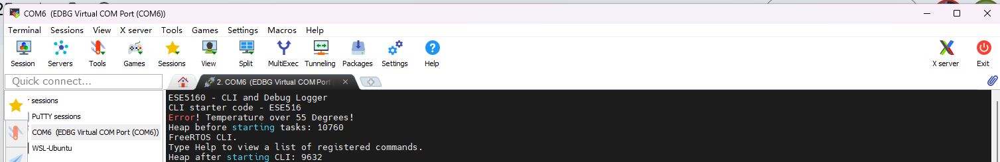
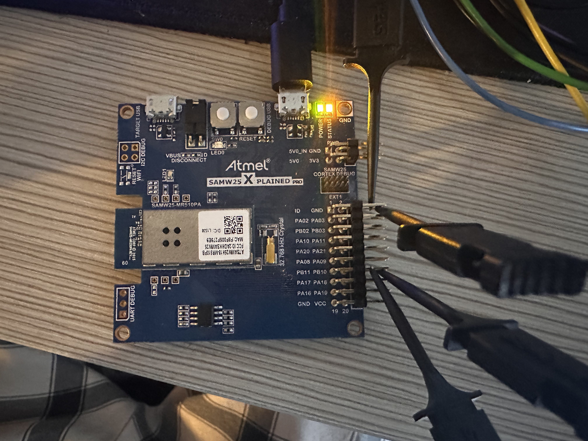
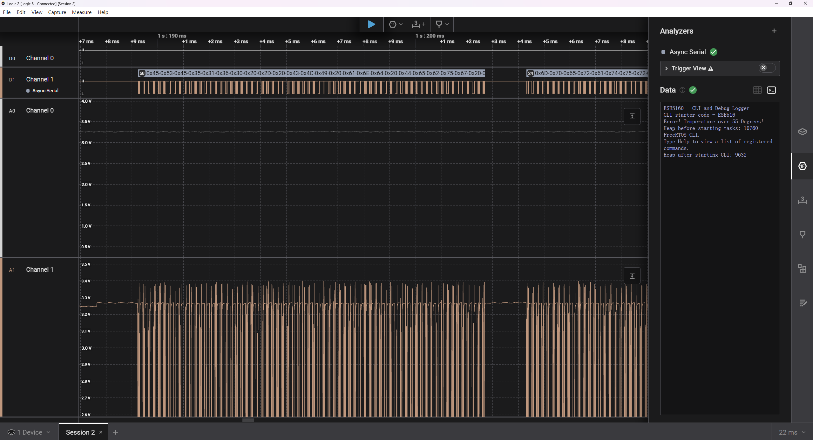
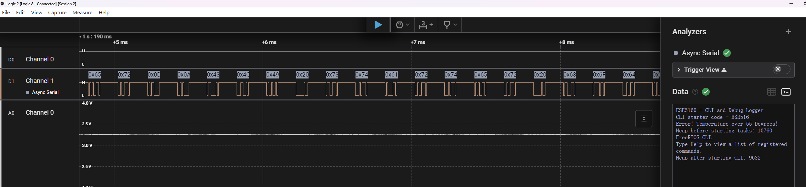

# a07g-exploring-the-CLI

* Team Number: 21
* Team Name: pixel & circuit
* Team Members: Zhongyu Wang, Linhai Deng
* GitHub Repository URL: https://github.com/ese5160/final-project-a07g-a14g-t21-pixel-circuit.git
* Description of test hardware: (development boards, sensors, actuators, laptop + OS, etc) laptop

## 3. Debug Logger Module

## 4. Wiretap the convo!

**4.1**
1. 

We need at least these three signals to monitor a standard UART connection:

UART TX – The microcontroller’s transmit line (data going out).

UART RX – The microcontroller’s receive line (data coming in), if you also want to observe traffic sent from the PC to the board.

GND – A common ground reference (the logic analyzer must share the same ground as the board).

2. 

For the SAMW25 Xplained Pro board, consult the “Xplained Pro Extension Header” pinouts. Typically:

Pin 14 = USART_TX; Pin 13 = USART_RX； Pin 2 or 19 = GND

3. 

When using Saleae Logic (or similar) to decode Async Serial (UART):

Analyzer Type: “Async Serial” or “UART.”

Baud Rate: Match the firmware setting (e.g., 115200).

Data Format: 8 bits, no parity, 1 stop bit (8N1).

Signal Inversion: Non-inverted (for typical 3.3 V TTL UART).

Voltage Reference: 3.3 V if your board’s UART is 3.3 V.

Sampling Rate: ≥1 MHz is common to reliably capture transitions.

Triggering: Often set to “None” or “Continuous” unless you’re hunting for a specific pattern.

**4.2**

**4.3**

