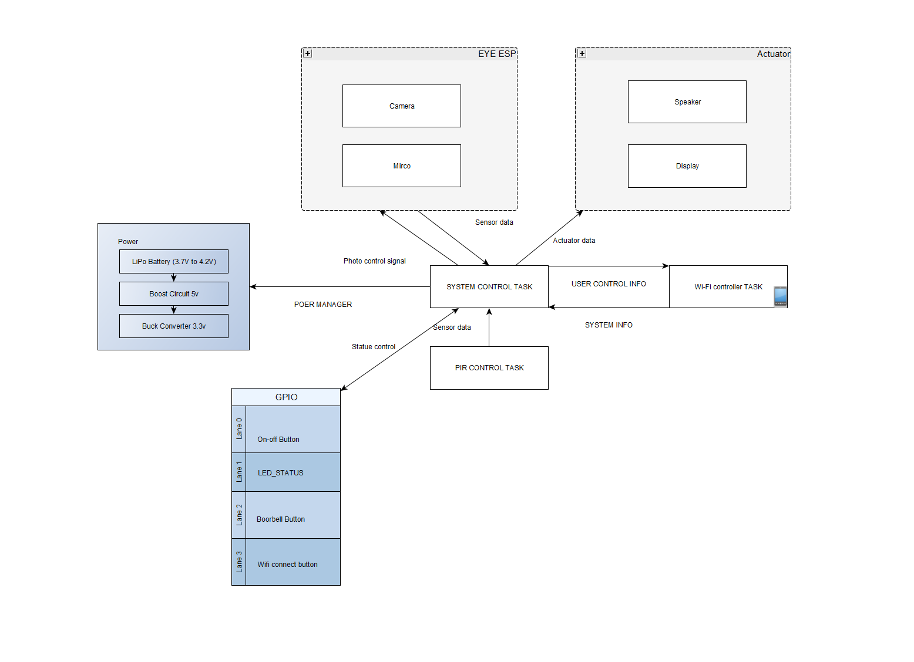
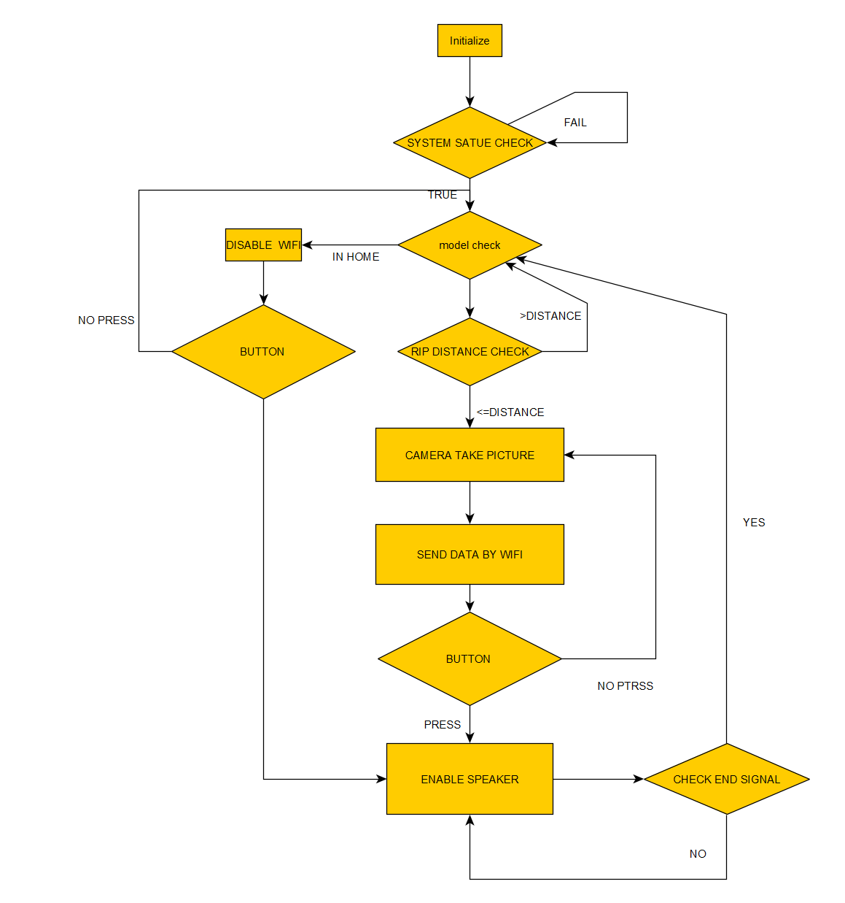
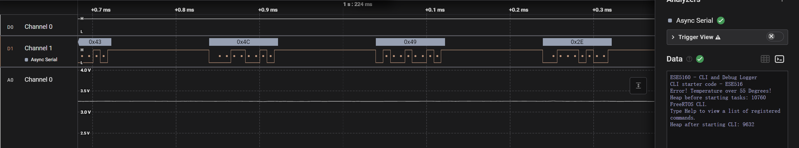

# a07g-exploring-the-CLI

* Team Number: 21
* Team Name: pixel & circuit
* Team Members: Zhongyu Wang, Linhai Deng
* GitHub Repository URL: https://github.com/ese5160/final-project-a07g-a14g-t21-pixel-circuit.git
* Description of test hardware: (development boards, sensors, actuators, laptop + OS, etc) laptop

## 1. Software Architecture
**1.1**

**Hardware Requirements Specification (HRS)**

1. PIR Motion Sensor

**Overview**

The Smart Doorbell System integrates sensors, actuators, and a Wi-Fi–enabled microcontroller to provide a secure, user-friendly solution for home security. The hardware components are carefully chosen to ensure efficient motion detection, real-time video streaming, and reliable two-way communication.

**Definitions and Abbreviations**

MCU: Microcontroller Unit

Wi-Fi: 802.11 wireless communication protocol

Li-Ion Battery: Lithium-ion rechargeable battery

PIR: Passive Infrared (motion detection sensor)

SPI/I²C: Common interfaces used for display or sensor communication with the MCU

**Functionality**

- HRS 01:

The system is based on an Espressif ESP-EYE (or a similar ESP32-based module) which provides Wi-Fi connectivity, an integrated camera, and a digital microphone. It also includes sufficient on-board PSRAM and Flash to handle real-time audio/video streaming.

- HRS 02:

A PIR motion sensor (e.g., Murata IRA-S210ST01) is used to detect movement within a typical range of 3–5 meters. Upon detecting motion, it outputs a digital signal to the MCU.

- HRS 03:

A display module (e.g., Univision UG-2864HSWEG01 OLED or a 1.8–2.4 inch TFT) is used for live video viewing and status information indoors. It communicates with the MCU via SPI or I²C.

- HRS 04:

The camera on the ESP-EYE (2 MP resolution) handles real-time video capture, while the on-board digital microphone supports audio input. This hardware combination enables live streaming and two-way communication.

- HRS 05:

One or more speakers (e.g., 8 Ω mini speaker, such as the CUI CMS-402811 series) are included for doorbell chimes and two-way audio output. The speaker will be driven by either a small amplifier or an audio output circuit connected to the MCU.

- HRS 06:

The system is powered by a single-cell 3.7 V Li-ion battery paired with a regulation circuit (3.3 V) to supply all components (MCU, camera, sensor, Wi-Fi).

**Limitations**

PIR sensor range may be affected by environmental factors (temperature, obstacles), with a practical detection range of about 3–5 meters.

Using a single Li-ion battery to power continuous Wi-Fi and video streaming can limit operating time; careful power management is required.

Low-light conditions may reduce camera image quality without additional illumination or a night-vision solution.

**Software Requirements Specification (SRS)**

**Overview**

The software in the Smart Doorbell System manages motion detection, video and audio streaming, real-time alerts to the user’s smartphone, and two-way communication. It supports both Home Mode (indoor display with local interaction) and Away Mode (remote monitoring and control via smartphone). This allows users to flexibly monitor visitors whether they are at home or away.

**Users**

- Primary Users:

Homeowners seeking enhanced security and convenience

Elderly residents or those with mobility challenges needing remote monitoring and communication

- Secondary Users:

Other household members or caregivers who may share access to the system for security purposes

**Definitions and Abbreviations**

UI: User Interface

MCU: Microcontroller Unit

Wi-Fi: IEEE 802.11 wireless communication

Alert: A real-time notification sent to the user’s smartphone

Home Mode: Mode enabling indoor display and local audio/video interaction

Away Mode: Mode enabling remote smartphone access to live video and two-way audio

**Functionality**

- SRS 01:

The system uses a PIR sensor to detect motion and processes the signal within 200 ms, triggering an alert process if movement is detected.

- SRS 02:

The system sends real-time notifications to the user’s smartphone via Wi-Fi, ideally within 500 ms of detecting motion. The notification can include text, image snapshots, or app-based alerts.

- SRS 03:

The system provides live video streaming in two scenarios:

Home Mode: Displays the video on the indoor screen in near-real time.

Away Mode: Streams video to a remote smartphone app or web interface at a resolution of at least 640×480 at 30 FPS (automatic scaling if bandwidth is limited).

- SRS 04:

The system supports two-way audio communication, allowing the user to speak with a visitor either through the indoor speaker/microphone setup (Home Mode) or remotely via the smartphone app (Away Mode). Target latency is under 300 ms where network conditions permit.

- SRS 05:

Mode Switching: The software shall enable switching between Home Mode and Away Mode through the indoor display menu, the smartphone app, or by automatic methods (e.g., geofencing). Switching to Away Mode automatically activates remote streaming and notifications.

- SRS 06:

Data Logging: The system shall locally store the last 24 hours of alerts and short video clips or snapshots (as memory constraints allow). Users can review recent motion events and recorded footage through either the indoor display or smartphone app.

- SRS 07:

Security & Reliability:

All audio/video data transmissions shall use secure channels (e.g., WPA2 Wi-Fi encryption, TLS if cloud-based).

Only authenticated users can view live streams or access stored videos.

If Wi-Fi disconnects, the software will retry until reconnected, then upload any missed event data.

**Limitations**

Network Stability: If Wi-Fi quality is poor or bandwidth is low, the system may experience reduced frame rates, delays, or dropped connections.

Continuous Recording: Prolonged continuous video recording may be limited by power consumption and on-board heat dissipation. A duty cycle or idle mode might be required to extend battery life.

Storage Constraints: Local storage (Flash or microSD) may be limited, so older data or clips could be overwritten once the storage is full.

**1.2**

**1.3**

## 2. Understanding the Starter Code

**1.What does InitializeSerialConsole() do? In that function, what are cbufRx and cbufTx? What type of data structure are they?**

- InitializeSerialConsole()

Creates and initializes two circular buffers (one for RX, one for TX).

Configures the USART peripheral (baud rate, pin multiplexing, etc.).

Registers the read/write callbacks that handle UART interrupts.

Starts an initial read job (usart_read_buffer_job) so the system constantly waits for incoming characters.

- cbufRx and cbufTx

Both are handles to circular (ring) buffers (type cbuf_handle_t).

These buffers hold incoming characters (RX) and outgoing characters (TX) without blocking the main program flow.

**2. How are cbufRx and cbufTx initialized? Where is the library that**

- Initialization:

cbufRx = circular_buf_init((uint8_t *)rxCharacterBuffer, RX_BUFFER_SIZE);
cbufTx = circular_buf_init((uint8_t *)txCharacterBuffer, TX_BUFFER_SIZE);

This call sets up each circular buffer with a pointer to a character array and a maximum size (512 bytes each in your code). The ring buffer’s internal indices (head/tail) are initialized to zero.

- Library Definition:

The function circular_buf_init() and the type cbuf_handle_t likely come from a ring buffer implementation in circular_buf.c (and declared in circular_buf.h) or from within SerialConsole.c/h if it is all inlined there.

Since your snippet shows #include "SerialConsole.h", the ring buffer functions may also be declared in that header or a related file included by it.

**3. Where are the character arrays where the RX and TX characters are stored at the end? Please mention their name and size.**

In SerialConsole.c, near the top, you have two global arrays:

#define RX_BUFFER_SIZE 512
#define TX_BUFFER_SIZE 512

char rxCharacterBuffer[RX_BUFFER_SIZE];
char txCharacterBuffer[TX_BUFFER_SIZE];

Each is 512 bytes in size. These arrays back the circular buffers for receive (cbufRx) and transmit (cbufTx).

**4. Where are the interrupts for UART character received and UART character sent defined?**

- Registered in configure_usart_callbacks():

usart_register_callback(&usart_instance,
                        usart_write_callback,
                        USART_CALLBACK_BUFFER_TRANSMITTED);

usart_register_callback(&usart_instance,
                        usart_read_callback,
                        USART_CALLBACK_BUFFER_RECEIVED);

- ISR callbacks themselves are:

usart_read_callback() (called when a receive buffer job completes)

usart_write_callback() (called when a transmit buffer job completes)

These callbacks handle reading/writing to the circular buffers in interrupt context.

**5. What are the callback functions that are called when:**

**a) A character is received?**

**b) A character has been sent?**

a) Character received (RX):

usart_read_callback() is invoked whenever the requested number of bytes (in this case, 1 byte) is received. In your code, it places the received character into cbufRx.

b) Character sent (TX):

usart_write_callback() is invoked when the transmit job finishes sending the current byte. It fetches the next byte from cbufTx and schedules another write job, if available.

**6. Explain what is being done on each of these two callbacks and how they relate to cbufRx and cbufTx.**

- usart_read_callback()

Takes the most recently received character (latestRx) and adds it into the RX ring buffer (cbufRx).

Gives a semaphore (xSemaphoreGiveFromISR(xRxSemaphore, ...)) to signal another task (like a CLI) that new data is available.

Calls usart_read_buffer_job(...) again to continuously capture the next incoming character.

- usart_write_callback()

Tries to get the next character from the TX ring buffer (cbufTx).

If it succeeds, it schedules another DMA/interrupt-driven transmit job for that character.

If there are no more characters, the transmit finishes until another write is initiated by SerialConsoleWriteString() or similar.

These callbacks ensure RX and TX happen asynchronously, without blocking the main program flow.

**7. Draw a diagram that explains the program flow for UART receive – starting with the user typing a character and ending with how that characters ends up in the circular buffer “cbufRx”. Please make reference to specific functions in the starter code.**

.drawio.png>)

**8. Draw a diagram that explains the program flow for the UART transmission – starting from a string added by the program to the circular buffer “cbufTx” and ending on characters being shown on the screen of a PC (On Teraterm, for example). Please make reference to specific functions in the starter code.**

.drawio.drawio.png>)

**9. What is done in the function startStasks() in main.c? How many threads (tasks) are started?**

- startStasks() (shown in your main.c) does the following:

Prints the current heap size for debugging.

Creates the CLI task (vCommandConsoleTask) via xTaskCreate(...).

Prints the heap size again.

In our snippet, only one FreeRTOS task (the CLI task) is created in startStasks(). However, we can add more tasks if needed.

## 3. Debug Logger Module

## 4. Wiretap the convo!

**4.1**
1. 

We need at least these three signals to monitor a standard UART connection:

UART TX – The microcontroller’s transmit line (data going out).

UART RX – The microcontroller’s receive line (data coming in), if you also want to observe traffic sent from the PC to the board.

GND – A common ground reference (the logic analyzer must share the same ground as the board).

2. 

For the SAMW25 Xplained Pro board, consult the “Xplained Pro Extension Header” pinouts. Typically:

Pin 14 = USART_TX; Pin 13 = USART_RX； Pin 2 or 19 = GND

3. 

When using Saleae Logic (or similar) to decode Async Serial (UART):

Analyzer Type: “Async Serial” or “UART.”

Baud Rate: Match the firmware setting (e.g., 115200).

Data Format: 8 bits, no parity, 1 stop bit (8N1).

Signal Inversion: Non-inverted (for typical 3.3 V TTL UART).

Voltage Reference: 3.3 V if your board’s UART is 3.3 V.

Sampling Rate: ≥1 MHz is common to reliably capture transitions.

Triggering: Often set to “None” or “Continuous” unless you’re hunting for a specific pattern.

**4.2**

**4.3**

## 5. Complete the CLI

I have update to github.

## 6. Add CLI commands

I have update to github.

link: https://youtu.be/flEjbNyZUMg